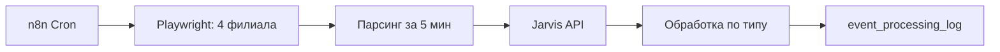
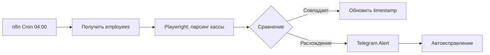

# Система парсинга и обработки UI событий из RentProg

**Дата:** 2025-11-05  
**Статус:** В разработке  
**Версия:** 1.0

---

## 📋 Обзор

Система для автоматического сбора и обработки событий из UI RentProg (страница "События"), которые недоступны через API или вебхуки.

### Основные компоненты

1. **n8n Workflow: RentProg Events Scraper** - парсинг каждые 5 минут
2. **n8n Workflow: Cash Register Reconciliation** - ночная сверка в 04:00
3. **Jarvis API Endpoint: POST /process-ui-event** - обработка событий
4. **Event Parsers** - извлечение структурированных данных
5. **Cash Register Service** - управление кассами сотрудников

---

## 🎯 Приоритеты обработки

### Высокий приоритет
- **Кассовые операции** (наличные)
  - "создал платёж №... расход наличными..."
  - "создал платёж №... приход наличными..."
  - Автоматическое обновление `employees.cash_*`

### Средний приоритет
- **Техобслуживание**
  - "завершил обслуживание №... в объекте №..."
  - Интеграция с системой задач (tasks)

- **Изменения статусов броней** (с выдачей/приемкой сегодня-завтра)
  - "принял авто, бронь №..."
  - "выдал авто, бронь №..."

### Низкий приоритет
- **Изменение пробега**
  - "изменил, mileage с на ... в авто №..."
  - Автоматическое обновление `cars.mileage`

---

## 🗄️ Структура БД

### Таблица `employees` (расширена)

```sql
ALTER TABLE employees 
  ADD COLUMN cash_gel NUMERIC DEFAULT 0,
  ADD COLUMN cash_usd NUMERIC DEFAULT 0,
  ADD COLUMN cash_eur NUMERIC DEFAULT 0,
  ADD COLUMN cash_last_updated TIMESTAMPTZ,
  ADD COLUMN cash_last_synced TIMESTAMPTZ,
  ADD COLUMN task_chat_id TEXT;
```

**Поля:**
- `cash_gel`, `cash_usd`, `cash_eur` - касса сотрудника по валютам
- `cash_last_updated` - последнее изменение кассы (из UI событий)
- `cash_last_synced` - последняя успешная сверка с RentProg UI (в 04:00)

### Таблица `event_processing_log` (новая)

```sql
CREATE TABLE event_processing_log (
  id UUID PRIMARY KEY,
  hash TEXT UNIQUE NOT NULL,           -- SHA256(branch + ts + description)
  event_data JSONB NOT NULL,           -- полные данные события
  event_type TEXT,                     -- cash_operation, maintenance, mileage, booking_status
  processed_at TIMESTAMPTZ DEFAULT NOW(),
  processing_result JSONB
);
```

**Назначение:** Дедупликация и аудит UI событий

---

## 🔄 Процесс работы

### 1. Парсинг событий (каждые 5 минут)



**Шаги:**
1. n8n Cron триггер каждые 5 минут
2. Параллельный запуск Playwright для 4 филиалов
3. Авторизация в RentProg UI
4. Переход на страницу `/events`
5. Парсинг событий за последние 5 минут
6. Отправка в Jarvis API `/process-ui-event`
7. Классификация и обработка
8. Запись в `event_processing_log`

### 2. Ночная сверка касс (04:00 Tbilisi)



**Шаги:**
1. Cron в 04:00 по Тбилиси
2. Получить всех активных сотрудников из БД
3. Для каждого сотрудника:
   - Playwright → RentProg UI → Компания → Сотрудники → [ФИО]
   - Парсинг реальной кассы (GEL, USD, EUR)
   - Сравнение с расчетной кассой в БД
4. Если расхождение > 0.01:
   - **Telegram Alert** в чат `-5004140602`
   - **Автоисправление** (RentProg = источник правды)
5. Обновить `cash_last_synced`

---

## 🔌 API Endpoint

### POST /process-ui-event

**URL:** `http://46.224.17.15:3000/process-ui-event`

**Body:**
```json
{
  "timestamp": "2025-11-05T18:46:00Z",
  "branch": "tbilisi",
  "rawDescription": "Neverov Leonid создал платёж №1834894, расход наличными 60.0GEL"
}
```

**Response:**
```json
{
  "ok": true,
  "eventType": "cash_operation",
  "processingResult": {
    "handled": true,
    "employeeId": "uuid",
    "operation": "subtract",
    "amount": 60.0,
    "currency": "GEL"
  }
}
```

---

## 📊 Типы событий

### 1. Кассовые операции (`cash_operation`)

**Примеры:**
- "Neverov Leonid создал платёж №1834894, расход наличными 60.0GEL"
- "Toma Khabuliani создал платёж №1834893, приход наличными 30.0USD"

**Обработка:**
```javascript
// Расход = вычесть из кассы
UPDATE employees 
SET cash_gel = cash_gel - 60.0, 
    cash_last_updated = NOW()
WHERE name = 'Neverov Leonid'

// Приход = добавить в кассу
UPDATE employees 
SET cash_usd = cash_usd + 30.0, 
    cash_last_updated = NOW()
WHERE name = 'Toma Khabuliani'
```

### 2. Техобслуживание (`maintenance`)

**Пример:**
- "Neverov Leonid завершил обслуживание №102306 в объекте №59439 закрепить омывайку..."

**Обработка:**
- Найти машину через `external_refs` (car_number = 59439)
- Найти существующую задачу по service_id или создать архивную
- Закрыть задачу (`status = 'done'`)
- Архивировать тему задачи в Telegram

### 3. Изменение пробега (`mileage_update`)

**Пример:**
- "Neverov Leonid изменил, mileage с на 95136 в авто № 69168"

**Обработка:**
```sql
UPDATE cars 
SET mileage = 95136, updated_at = NOW()
WHERE id = (
  SELECT entity_id FROM external_refs 
  WHERE system='rentprog' AND external_id='69168'
)
```

### 4. Изменение статуса брони (`booking_status`)

**Примеры:**
- "Neverov Leonid принял авто, бронь №505165"
- "Toma Khabuliani выдал авто, бронь №505165"

**Обработка:**
- Найти бронь через `external_refs`
- Проверить даты выдачи/приемки (сегодня-завтра)
- Если в интервале → создать уведомление

---

## 🔧 Конфигурация

### Credentials в n8n

**RentProg UI доступ (по филиалам):**
```json
{
  "tbilisi": { 
    "login": "tbilisi_user", 
    "password": "PASSWORD" 
  },
  "batumi": { 
    "login": "batumi_user", 
    "password": "PASSWORD" 
  },
  "kutaisi": { 
    "login": "kutaisi_user", 
    "password": "PASSWORD" 
  },
  "service-center": { 
    "login": "service_user", 
    "password": "PASSWORD" 
  }
}
```

**Telegram Bot:**
- Credential: "Telegram account"
- Alert Chat ID: `-5004140602` (TG Alert Chat)

**PostgreSQL:**
- Credential: "PostgreSQL (Neon)"
- Connection String: из `config/n8n-variables.yaml`

---

## 🚀 Запуск

### 1. Применить миграции БД

```bash
# На сервере или локально через Neon Console
node setup/migrations/005_add_employee_cash_fields.sql
node setup/migrations/006_create_event_processing_log.sql
```

### 2. Запустить Jarvis API

```bash
cd /root/geodrive_n8n-agents
npm install
npm run build
pm2 start dist/index.js --name jarvis-api
pm2 save
```

### 3. Импортировать n8n workflows

```powershell
# Локально через PowerShell
.\setup\import_workflow.ps1 -File "n8n-workflows/rentprog-events-scraper.json"
.\setup\import_workflow.ps1 -File "n8n-workflows/cash-register-reconciliation.json"
```

### 4. Настроить credentials в n8n

1. Открыть n8n UI: `https://n8n.rentflow.rentals`
2. Settings → Credentials
3. Добавить RentProg UI доступы (4 филиала)
4. Проверить Telegram Bot credential
5. Проверить PostgreSQL credential

### 5. Активировать workflows

```
https://n8n.rentflow.rentals/workflows
→ RentProg Events Scraper → Active: ON
→ Cash Register Reconciliation → Active: ON
```

---

## 🔍 Мониторинг

### Проверка работы парсинга

```sql
-- Последние обработанные события
SELECT 
  event_type,
  event_data->>'actor' as actor,
  event_data->>'action' as action,
  processed_at
FROM event_processing_log
ORDER BY processed_at DESC
LIMIT 10;
```

### Проверка касс сотрудников

```sql
-- Текущие кассы
SELECT 
  name,
  cash_gel,
  cash_usd,
  cash_eur,
  cash_last_updated,
  cash_last_synced
FROM employees
WHERE role != 'inactive'
ORDER BY cash_last_updated DESC NULLS LAST;
```

### Логи n8n

```
https://n8n.rentflow.rentals/executions
→ Фильтр по workflow: "RentProg Events Scraper"
→ Проверить последние executions
```

---

## ⚠️ Важные замечания

### 1. Первый запуск
При первом запуске ночной сверки (04:00) будет **инициализация касс** из RentProg UI.

### 2. Селекторы Playwright
Селекторы в Playwright скриптах (`[data-field="cash-gel"]`) - **примеры**. Нужно обновить после получения реального доступа к UI.

### 3. Расхождение касс
При обнаружении расхождения:
- **RentProg UI = источник правды**
- Автоматическое исправление в БД
- Telegram Alert в чат `-5004140602`

### 4. Дедупликация
Hash события = SHA256(branch + timestamp + description). Повторная обработка невозможна.

### 5. Автоочистка логов
Рекомендуется запускать раз в месяц:
```sql
SELECT cleanup_old_event_logs(30); -- удалить старше 30 дней
```

---

## 📚 См. также

- [ARCHITECTURE.md](../ARCHITECTURE.md) - Архитектура системы
- [STRUCTURE.md](../STRUCTURE.md) - Структура данных (подсистема задач)
- [AGENTS.md](../AGENTS.md) - Агент задач (Jarvis Tasks)
- [NEXT_STEPS.md](../NEXT_STEPS.md) - Roadmap

---

**Статус:** Готово к тестированию после получения credentials  
**Автор:** Claude Sonnet 4.5  
**Дата создания:** 2025-11-05

