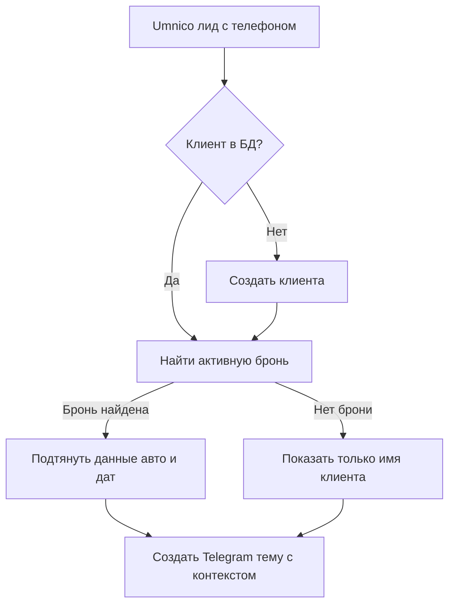

# Анализ данных Umnico Export

**Дата анализа:** 2025-11-11  
**Источник:** Excel экспорт из Umnico (`umnico-leads.xlsx`)

---

## 📊 Общая статистика

- **Всего записей:** 1,916 лидов
- **Период:** с 17.09.2025 по 09.11.2025
- **Канал:** Telegram (100%)
- **Заполненность телефонов:** 85% (1,635 из 1,916)
- **Уникальных клиентов:** ~1,583 (по телефону)

---

## 🔑 Доступные поля данных

### ✅ Полезные поля (высокая заполненность)

| Поле | Заполненность | Уникальных значений | Применение |
|------|---------------|---------------------|------------|
| **Канал** | 100% | 2 | Определение источника (Telegram/WhatsApp) |
| **Дата создания** | 100% | 1,902 | Первое сообщение клиента |
| **Дата изменения** | 100% | 1,325 | Последняя активность |
| **Ответственный** | 100% | 21 | Email сотрудника (из AmoCRM) |
| **Статус** | 100% | 2 | Состояние лида |
| **Имя клиента** | 100% | 1,854 | ФИО или никнейм |
| **Профиль клиента** | 96% | 1,835 | Username в Telegram |
| **Телефон клиента** | 85% | 1,583 | Ключ для связи с RentProg |

### ⚠️ Пустые поля (не используются)

- Теги
- Почта клиента
- Адрес клиента
- Товар
- Комментарий
- Ближайшая задача

---

## 💡 Ключевые находки

### 1. Связь с сотрудниками

**Формат ответственного:**
```
imported_from_amocrm_31787_122591_11640614_trustme06051977@gmail.com
```

**Структура:** `imported_from_amocrm_{company_id}_{user_id}_{external_id}_{email}`

**Что можно извлечь:**
- Email сотрудника → сопоставить с таблицей `employees`
- AmoCRM User ID → для будущей интеграции с AmoCRM API

**Пример парсинга:**
```javascript
const match = responsible.match(/imported_from_amocrm_\d+_\d+_\d+_(.+)/);
const email = match ? match[1] : null;
// email: "trustme06051977@gmail.com"
```

---

### 2. Телефоны клиентов (85% заполненность)

**Формат:** международный (`+79936033142`)

**Применение:**
- Поиск клиента в таблице `clients` (по нормализованному телефону)
- Связь с активной бронью через `bookings.client_id`
- Автоматическое создание клиента, если не найден

**Важно:** 15% лидов без телефона (групповые чаты, боты)

---

### 3. Временные данные

**Дата создания vs Дата изменения:**
- Разница показывает длительность диалога
- Диалоги без изменений = неотвеченные лиды
- Можно определить "холодные" лиды (>7 дней без активности)

**Статистика по времени:**
```
Средняя длительность диалога = Дата изменения - Дата создания
```

---

## 🎯 Рекомендации по использованию

### 1. Импорт исторических данных

**Цель:** Создать базу истории диалогов для контекста

**Процесс:**
```sql
-- Создать записи в conversations для исторических диалогов
INSERT INTO conversations (
  umnico_conversation_id,
  client_name,
  client_phone,
  channel,
  status,
  created_at,
  last_message_at
)
SELECT 
  MD5('telegram_' || "Профиль клиента") as umnico_conversation_id,
  "Имя клиента",
  NULLIF("Телефон клиента", '') as client_phone,
  'telegram' as channel,
  CASE 
    WHEN "Статус" = 'Первичный контакт' THEN 'active'
    ELSE 'closed'
  END as status,
  TO_TIMESTAMP("Дата создания", 'DD.MM.YYYY HH24:MI:SS'),
  TO_TIMESTAMP("Дата изменения", 'DD.MM.YYYY HH24:MI:SS')
FROM umnico_export
WHERE "Телефон клиента" IS NOT NULL;
```

---

### 2. Сопоставление с сотрудниками

**Алгоритм:**
```javascript
// 1. Извлечь email из поля "Ответственный"
const extractEmail = (responsible) => {
  const match = responsible.match(/([a-zA-Z0-9._-]+@[a-zA-Z0-9._-]+\.[a-zA-Z0-9_-]+)$/);
  return match ? match[1] : null;
};

// 2. Найти сотрудника в БД
const employee = await sql`
  SELECT id, name FROM employees 
  WHERE email = ${extractEmail(responsible)}
`;

// 3. Назначить ответственного на conversation
await sql`
  UPDATE conversations 
  SET assigned_employee_id = ${employee.id}
  WHERE umnico_conversation_id = ${conversationId}
`;
```

---

### 3. Связь с клиентами и бронями

**Поток обработки:**



**SQL запрос:**
```sql
-- Найти клиента и его активную бронь
SELECT 
  c.id as client_id,
  c.name as client_name,
  b.id as booking_id,
  car.name as car_name,
  b.pickup_date,
  b.return_date
FROM clients c
LEFT JOIN bookings b ON b.client_id = c.id 
  AND b.status IN ('confirmed', 'active')
  AND b.return_date >= NOW()
LEFT JOIN cars car ON car.id = b.car_id
WHERE c.phone_normalized = normalize_phone('+79936033142')
ORDER BY b.pickup_date DESC
LIMIT 1;
```

---

### 4. Обогащение Telegram тем

**Название темы:**
```javascript
// С бронью:
"Arina Golovko | Toyota Camry | 15.11-20.11"

// Без брони:
"Arina Golovko | +7 993 603-31-42"
```

**Закрепленное сообщение:**
```
👤 Клиент: Arina Golovko
📞 Телефон: +7 993 603-31-42
🚗 Авто: Toyota Camry
📅 Даты: 15.11-20.11
👤 Ответственный: Николай Худницкий

📊 История:
• Первый контакт: 17.09.2025 13:21
• Последнее сообщение: 01.10.2025 10:10
• Диалогов: 3

🔗 Полная история: https://conversations.rentflow.rentals?id=12345
```

---

### 5. Миграция данных в БД

**Скрипт импорта:**
```javascript
// setup/import_umnico_history.mjs
import XLSX from 'xlsx';
import { sql } from '../src/db/index.js';

const workbook = XLSX.readFile('excel/umnico-leads.xlsx');
const data = XLSX.utils.sheet_to_json(workbook.Sheets['Data']);

for (const row of data) {
  // Пропустить групповые чаты и записи без телефона
  if (!row['Телефон клиента'] || row['Имя клиента'].includes('Group')) {
    continue;
  }
  
  const phone = normalizePhone(row['Телефон клиента']);
  const email = extractEmail(row['Ответственный']);
  
  // Найти или создать клиента
  let client = await sql`
    SELECT id FROM clients WHERE phone_normalized = ${phone}
  `;
  
  if (client.length === 0) {
    client = await sql`
      INSERT INTO clients (name, phone, phone_normalized)
      VALUES (${row['Имя клиента']}, ${row['Телефон клиента']}, ${phone})
      RETURNING id
    `;
  }
  
  // Найти сотрудника
  const employee = await sql`
    SELECT id FROM employees WHERE email = ${email}
  `;
  
  // Создать запись диалога
  await sql`
    INSERT INTO conversations (
      umnico_conversation_id,
      client_id,
      client_name,
      channel,
      status,
      created_at,
      last_message_at,
      assigned_employee_id
    ) VALUES (
      ${'telegram_' + row['Профиль клиента']},
      ${client[0].id},
      ${row['Имя клиента']},
      'telegram',
      ${row['Статус'] === 'Первичный контакт' ? 'active' : 'closed'},
      ${parseUmnicoDate(row['Дата создания'])},
      ${parseUmnicoDate(row['Дата изменения'])},
      ${employee.length > 0 ? employee[0].id : null}
    )
    ON CONFLICT (umnico_conversation_id) DO NOTHING
  `;
}

console.log('✅ Импорт завершен');
```

---

## 📈 Статистика и аналитика

### Что можно построить из этих данных:

1. **Конверсия по сотрудникам:**
   - Количество лидов на сотрудника
   - Процент закрытых сделок
   - Среднее время ответа

2. **Динамика лидов:**
   - Новые лиды по дням/неделям
   - Пиковые часы обращений
   - Сезонность

3. **Качество работы:**
   - Неотвеченные лиды (дата создания = дата изменения)
   - "Холодные" лиды (>7 дней без активности)
   - Средняя длительность диалога до закрытия

4. **Источники:**
   - Telegram vs WhatsApp
   - Групповые чаты vs личные сообщения

---

## ⚡ Приоритетные действия

### Шаг 1: Создать скрипт импорта исторических данных
- [ ] `setup/import_umnico_history.mjs`
- [ ] Функция нормализации телефона
- [ ] Функция парсинга дат из Umnico формата
- [ ] Функция извлечения email из ответственного

### Шаг 2: Обновить UmnicoTelegramBridge
- [ ] Использовать email ответственного для назначения сотрудника
- [ ] Добавить поле `umnico_responsible_email` в таблицу `conversations`

### Шаг 3: Тестирование
- [ ] Импортировать 10-20 записей для проверки
- [ ] Проверить связь телефонов с клиентами в БД
- [ ] Проверить связь с активными бронями

### Шаг 4: Запуск полного импорта
- [ ] Импортировать все 1,916 записей
- [ ] Проверить статистику в БД
- [ ] Обновить веб-интерфейс для отображения истории

---

## 🔗 Связанные документы

- [UMNICO_TELEGRAM_BRIDGE.md](./UMNICO_TELEGRAM_BRIDGE.md) - Архитектура интеграции
- [WEB_INTERFACE_SETUP.md](./WEB_INTERFACE_SETUP.md) - Веб-интерфейс истории
- [STRUCTURE.md](../STRUCTURE.md) - Структура данных

---

**Вывод:** Данные из Umnico экспорта содержат всю необходимую информацию для построения полноценной интеграции. Основные ключи - телефон клиента (связь с RentProg) и email ответственного (связь с сотрудниками). Рекомендуется провести импорт исторических данных для обогащения контекста в Telegram темах.

