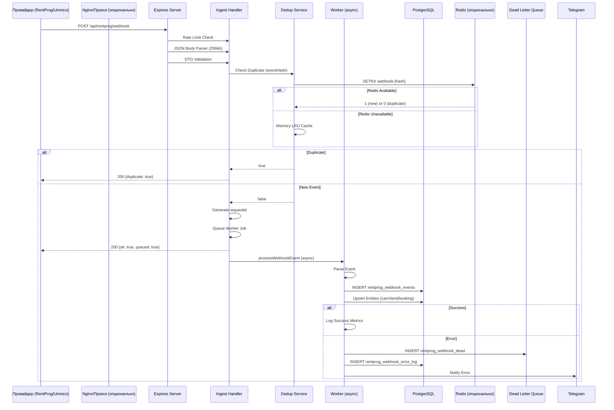

# Технический отчет: Архитектура обработки вебхуков

## Executive Summary

Система обработки вебхуков в GeoDrive Backend использует **архитектуру Fast ACK с асинхронной обработкой**, что обеспечивает высокую надежность и быстрый отклик на входящие запросы. Основные принципы:

1. **Разделение синхронной и асинхронной обработки**: Синхронная часть (≤500ms) отвечает за валидацию, дедупликацию и быстрое подтверждение (ACK), а тяжелые операции (парсинг, БД, внешние API) выполняются асинхронно в фоновом воркере.

2. **Многоуровневая надежность**: Дедупликация через Redis/Memory, Dead Letter Queue для проблемных событий, подробное логирование ошибок, метрики и мониторинг.

3. **Масштабируемость**: In-process очередь с ограничением concurrency, поддержка параллельной обработки множественных вебхуков, rate limiting для защиты от перегрузки.

**Ключевые технологии**: Express.js, PostgreSQL, Redis (опционально), in-memory LRU кеш, WebSocket для real-time уведомлений.

**Основные преимущества**:
- Быстрый ACK (≤500ms) предотвращает таймауты от провайдеров
- Гарантированная доставка через Dead Letter Queue
- Отказоустойчивость при недоступности Redis (fallback на memory)
- Детальная наблюдаемость через метрики и логи

---

## 1. Детальная архитектура

### 1.1 Диаграмма потока данных



### 1.2 Компоненты системы

#### 1.2.1 Express Server (`src/server/bootstrap.js`, `src/server/appFactory.js`)

**Конфигурация HTTP сервера**:
```javascript
server.keepAliveTimeout = 65000ms (default)
server.headersTimeout = 66000ms (keepAliveTimeout + 1000)
server.requestTimeout = REQUEST_TIMEOUT_MS (если задано)
server.setTimeout(SOCKET_TIMEOUT_MS) (если задано)
```

**Middleware pipeline**:
1. CORS (`src/server/cors.js`) - настройка CORS для фронтендов
2. Security headers (Helmet) - базовые заголовки безопасности
3. JSON body parser (глобально 2MB, для webhook routes 256KB)
4. Unified Auth - проверка JWT токенов
5. Request ID middleware - генерация уникальных ID для трейсинга
6. Inflight requests counter - отслеживание активных запросов

#### 1.2.2 Webhook Routes (`src/routes/rentprog/webhook/routes.js`)

**Endpoints**:
- `POST /api/rentprog/webhook` - основной endpoint
- `POST /webhook/rentprog-webhook-create` - алиас для совместимости
- `GET /webhooks/_selftest` - мониторинг состояния системы

**Специфичные middleware для webhook routes**:
- `webhookRateLimit` - in-memory rate limiting (30 RPS по умолчанию)
- `webhookJsonLimit` - ограничение размера JSON (256KB)
- `webhookDtoValidator` - валидация структуры payload через Zod schema

#### 1.2.3 Ingest Handler (`src/routes/rentprog/webhook/ingest.js`)

**Функция**: `handleWebhook(req, res)`

**Синхронная обработка (≤500ms)**:
1. Генерация `requestId` (из заголовков или UUID)
2. Генерация `eventHash` (SHA256 от headers + payload)
3. Проверка дедупликации через Redis/Memory
4. Постановка задачи в очередь (async worker)
5. Быстрый ACK (200 OK) с `event_hash` и `request_id`

**Ключевые особенности**:
- Всегда возвращает 200 OK (даже при ошибках) - ошибки логируются, но не отправляются провайдеру
- Дедупликация происходит до постановки в очередь
- Worker запускается после отправки ответа (через `res.once('finish')`)

#### 1.2.4 Deduplication Service (`src/routes/rentprog/webhook/dedup.js`)

**Двухуровневая система**:

1. **Redis (приоритет)**:
   - Использует `SETNX` для атомарной проверки/установки
   - TTL: `WEBHOOK_DEDUP_TTL_SEC` (900 секунд = 15 минут по умолчанию)
   - Ключ: `webhook:{eventHash}`

2. **Memory LRU Cache (fallback)**:
   - In-memory Map с TTL
   - Автоматическая очистка истекших записей
   - Максимальный размер: 10000 записей
   - LRU eviction при превышении лимита

**Формула eventHash**:
```javascript
SHA256(JSON.stringify({
  'x-webhook-id': headers['x-webhook-id'] || '',
  'x-event-id': headers['x-event-id'] || '',
  'x-delivery-id': headers['x-delivery-id'] || '',
  timestamp: headers['x-timestamp'] || headers['timestamp'] || '',
  payload
}))
```

#### 1.2.5 Worker (`src/routes/rentprog/webhook/worker.js`)

**Функция**: `processWebhookEvent(job)`

**Асинхронная обработка**:
1. **Парсинг и нормализация**:
   - Использует новый parser (`src/routes/rentprog/webhook/parser/index.js`)
   - Fallback на legacy parser при ошибках
   - Извлечение entity/action/id/branch

2. **Сохранение события в БД**:
   - `INSERT INTO rentprog_webhook_events` с таймаутом 1500ms
   - Запись всех метаданных (entity, action, branch, actor_id, description)

3. **Обработка по типу сущности**:
   - `car` → `processCarEvent` → upsert в `rentprog_cars`
   - `client` → `processClientEvent` → upsert в `rentprog_clients`
   - `booking` → `processBookingEvent` → upsert в `rentprog_bookings`

4. **Дополнительные операции**:
   - Upsert branches, employees
   - WebSocket broadcast для real-time обновлений
   - Обработка special cases (branch changes, etc.)

**Обработка ошибок**:
- Все ошибки логируются в `rentprog_webhook_error_log`
- Критические ошибки попадают в `rentprog_webhook_dead` (Dead Letter Queue)
- Уведомления в Telegram для критических ошибок

#### 1.2.6 In-Process Queue (`src/routes/rentprog/webhook/ingest.js`)

**Простая очередь с ограничением concurrency**:
```javascript
const ASYNC_LIMIT = env.WEBHOOK_ASYNC_CONCURRENCY || 4
let asyncActive = 0
const asyncQueue = []
```

**Механизм**:
- Если `asyncActive < ASYNC_LIMIT` → запуск немедленно
- Иначе → добавление в `asyncQueue`
- После завершения задачи → запуск следующей из очереди

**Метрики**:
- `webhook_jobs_inflight` - текущее количество активных задач
- Отслеживание через `incWebhookJobsInflight()` / `decWebhookJobsInflight()`

#### 1.2.7 Dead Letter Queue (`src/routes/rentprog/webhook/deadletter.js`)

**Таблица**: `rentprog_webhook_dead`

**Поля**:
- `id`, `created_at`, `payload` (JSONB)
- `error` (текст ошибки)
- `status` ('worker_fail', 'replayed', etc.)
- `event_id`, `event_name`
- `retry_count`, `last_retry_at`

**API для управления**:
- `GET /api/rentprog/webhook/dead` - список проблемных событий
- `POST /api/rentprog/webhook/dead/:id/replay` - повторная обработка
- `POST /api/rentprog/webhook/dead/cleanup` - очистка старых записей
- `DELETE /api/rentprog/webhook/dead/:id` - удаление записи

---

## 2. Механизмы надежности

### 2.1 Гарантия доставки всех вебхуков

#### 2.1.1 Fast ACK Pattern

**Проблема**: Провайдеры вебхуков (RentProg, Umnico) имеют таймауты (обычно 5-30 секунд). Если обработка занимает больше времени, провайдер считает запрос неудачным и повторяет его.

**Решение**: Система всегда отвечает 200 OK в течение ≤500ms, даже если обработка еще не завершена.

```javascript
// src/routes/rentprog/webhook/ingest.js:143-154
res.status(200).json({ 
  ok: true, 
  queued: true,
  request_id: requestId,
  event_hash: eventHash.slice(0, 12),
  syncMs: ackMs 
})
```

**Результат**:
- Провайдер получает подтверждение быстро
- Обработка продолжается асинхронно
- Даже при ошибках обработки, вебхук уже "принят" провайдером

#### 2.1.2 Дедупликация

**Защита от повторной обработки**:
- Каждый вебхук имеет уникальный `eventHash`
- Проверка происходит **до** постановки в очередь
- Повторные доставки от провайдера помечаются как `duplicate: true` и не обрабатываются

**Реализация**:
```javascript
// src/routes/rentprog/webhook/dedup.js:75-95
export async function checkDuplicate(eventHash, ttlSec) {
  // Попытка Redis SETNX (атомарная операция)
  const redis = global.__WEBHOOK_REDIS__ || null
  if (redis && typeof redis.setnx === 'function') {
    const result = await redis.setnx(`webhook:${eventHash}`, '1')
    if (result === 1) {
      await redis.expire(`webhook:${eventHash}`, ttlSec)
      return false // не дубликат
    }
    return true // дубликат
  }
  // Fallback на memory cache
  return memoryCache.checkAndSet(eventHash, ttlSec)
}
```

#### 2.1.3 Dead Letter Queue

**Для проблемных событий**:
- Если обработка в worker завершилась с ошибкой → событие сохраняется в `rentprog_webhook_dead`
- Администратор может просмотреть, повторить обработку или вручную исправить проблему
- Все события сохраняются, ничто не теряется

**Пример**:
```javascript
// src/routes/rentprog/webhook/worker.js:289-297
let deadId = null
try {
  const insDead = await q(
    'insert into rentprog_webhook_dead(payload,error,status,event_id,event_name) values($1,$2,$3,$4,$5) returning id',
    [evt || {}, fmt(err), 'worker_fail', String(eventId || ''), safeParsed.rawType || '']
  )
  deadId = insDead?.rows?.[0]?.id || null
} catch { /* no-op */ }
```

### 2.2 Параллельная обработка

#### 2.2.1 In-Process Queue с Concurrency Limit

**Ограничение параллелизма**:
- По умолчанию: 4 одновременных задачи (`WEBHOOK_ASYNC_CONCURRENCY`)
- Остальные задачи ждут в очереди
- Защита от перегрузки памяти и БД

**Реализация**:
```javascript
// src/routes/rentprog/webhook/ingest.js:40-63
function runAsync(task) {
  const schedule = (fn) => {
    asyncActive++
    incWebhookJobsInflight()
    setImmediate(() => {
      Promise.resolve()
        .then(fn)
        .catch((err) => {
          logger.error('[webhook-async] worker task failed:', fmt(err))
        })
        .finally(() => {
          asyncActive--
          decWebhookJobsInflight()
          if (asyncQueue.length) {
            const next = asyncQueue.shift()
            if (next) schedule(next)
          }
        })
    })
  }

  if (asyncActive < ASYNC_LIMIT) schedule(task)
  else asyncQueue.push(task)
}
```

#### 2.2.2 Rate Limiting

**Защита от перегрузки**:
- In-memory rate limiter для webhook endpoints
- По умолчанию: 30 RPS на IP
- Настраивается через `WEBHOOK_RATE_RPS`

**Реализация**:
```javascript
// src/routes/rentprog/webhook/routes.js:28-53
function checkWebhookRateLimit(ip) {
  const key = ip || '?'
  const now = Date.now()
  const windowMs = 60 * 1000 // 1 минута
  const maxRequests = env.WEBHOOK_RATE_RPS || 30
  
  const entry = webhookHits.get(key) || { count: 0, resetTime: now + windowMs }
  
  if (now > entry.resetTime) {
    entry.count = 1
    entry.resetTime = now + windowMs
  } else {
    entry.count++
  }
  
  webhookHits.set(key, entry)
  return entry.count <= maxRequests
}
```

### 2.3 Обработка ошибок

#### 2.3.1 Многоуровневое логирование

**1. Error Log Table** (`rentprog_webhook_error_log`):
- Записываются все ошибки на всех этапах (sync, worker, replay)
- Поля: `phase`, `kind` ('err', 'warn', 'dry_run'), `error`, `payload`, `meta`
- Индексы по `phase`, `kind`, `created_at` для быстрого поиска

**2. Dead Letter Queue**:
- Критические ошибки, которые привели к полному сбою обработки
- Можно повторить обработку через API

**3. Telegram Notifications**:
- Критические ошибки отправляются в Telegram для быстрого реагирования
- Только для `kind === 'error'` или `kind === 'err'`

#### 2.3.2 Graceful Error Handling

**Принцип**: Всегда возвращать 200 OK провайдеру, даже при ошибках.

```javascript
// src/routes/rentprog/webhook/ingest.js:166-195
catch (e) {
  trackWebhook('err')
  const ackMs = Date.now() - startTime
  trackWebhookAckLatency(ackMs)
  
  await logWebhookIssue({ 
    phase: 'sync', 
    kind: 'err', 
    error: fmt(e), 
    payload: req.body || {}, 
    meta: { stage: 'sync.exception', requestId, ackMs } 
  })
  
  // ВСЕГДА возвращаем 200, даже при ошибке
  return res.status(200).json({ 
    ok: false, 
    stored: true, 
    request_id: requestId,
    syncMs: ackMs 
  })
}
```

**Почему так**:
- Провайдер не будет повторять запрос, если получил 200 OK
- Ошибка обработана и залогирована
- Можно восстановить данные из dead letter queue позже

### 2.4 Мониторинг и метрики

#### 2.4.1 Метрики (`src/metrics/counters.js`)

**Счетчики**:
- `webhook_ok_1m` - успешные вебхуки за последнюю минуту
- `webhook_err_1m` - синхронные ошибки
- `webhook_async_err_1m` - асинхронные ошибки (в worker)
- `webhook_duplicates_total` - общее количество дубликатов
- `webhook_ack_avg_ms_1m` - средняя латентность ACK
- `webhook_ack_p95_ms_1m` - 95-й перцентиль латентности ACK
- `webhook_jobs_inflight` - текущее количество задач в обработке

**Доступ**:
- `GET /metrics` - JSON с текущими значениями
- `GET /metrics/history` - история метрик

#### 2.4.2 Selftest Endpoint

**`GET /webhooks/_selftest`** возвращает полную картину состояния:

```json
{
  "ok": true,
  "iconv": "up|down",
  "jsonLimit": "256kb",
  "rateRps": 30,
  "redis": "up|down|absent",
  "queue": {
    "inflight": 2,
    "pending": 0,
    "fetch_full_backlog": 5
  },
  "readiness": {
    "shutting_down": false,
    "server_inflight": 10
  },
  "dedup": {
    "backend": "redis|memory",
    "ttl": 900,
    "memorySize": 1234
  },
  "metrics": {
    "webhook_ok_1m": 45,
    "webhook_err_1m": 0,
    "webhook_ack_avg_ms_1m": 120
  }
}
```

---

## 3. Конфигурация и настройки

### 3.1 Переменные окружения

**Webhook-specific**:
- `WEBHOOK_JSON_LIMIT` - лимит размера JSON body (default: '256kb')
- `WEBHOOK_RATE_RPS` - rate limit в запросах в секунду (default: 30)
- `WEBHOOK_ACK_SLA_MS` - SLA для ACK latency (default: 500ms)
- `WEBHOOK_DEDUP_TTL_SEC` - TTL для дедупликации (default: 900 = 15 минут)
- `WEBHOOK_ASYNC_CONCURRENCY` - количество параллельных worker задач (default: 4)
- `WEBHOOK_WORKER_DEFER_MS` - задержка перед запуском worker (default: 5ms)
- `WEBHOOK_ACK_FAST` - режим быстрого ACK без обработки (default: '0')
- `WEBHOOK_SKIP_WORKER` - пропустить обработку в worker (default: '0')

**Server-specific**:
- `KEEP_ALIVE_TIMEOUT_MS` - keep-alive timeout (default: 65000)
- `HEADERS_TIMEOUT_MS` - headers timeout (default: keepAliveTimeout + 1000)
- `REQUEST_TIMEOUT_MS` - request timeout (optional)
- `SOCKET_TIMEOUT_MS` - socket timeout (optional)

**Redis**:
- `REDIS_URL` или `REDIS_PUBLIC_URL` - URL для подключения к Redis
- Если не задан → используется memory fallback

### 3.2 HTTP Server Configuration

```javascript
// src/server/bootstrap.js:22-27
server.keepAliveTimeout = Number(process.env.KEEP_ALIVE_TIMEOUT_MS || 65000)
server.headersTimeout = Number(process.env.HEADERS_TIMEOUT_MS || (server.keepAliveTimeout + 1000))
if (process.env.REQUEST_TIMEOUT_MS) server.requestTimeout = Number(process.env.REQUEST_TIMEOUT_MS)
if (process.env.SOCKET_TIMEOUT_MS) server.setTimeout?.(Number(process.env.SOCKET_TIMEOUT_MS))
```

### 3.3 Database Configuration

**Таблицы**:
- `rentprog_webhook_events` - все принятые события
- `rentprog_webhook_dead` - проблемные события (DLQ)
- `rentprog_webhook_error_log` - все ошибки обработки

**Индексы**:
- `idx_rentprog_webhook_events_received_at` - для быстрого поиска по времени
- `idx_rentprog_webhook_dead_created_at` - для cleanup
- `idx_rentprog_webhook_dead_status` - для фильтрации по статусу
- `idx_webhook_error_created_at` - для анализа ошибок
- `idx_webhook_error_phase` - для фильтрации по фазе обработки
- `idx_webhook_error_kind` - для фильтрации по типу ошибки

---

## 4. Отличия от типовых систем

### 4.1 Сравнительная таблица

| Аспект | GeoDrive Backend | Типовая система |
|--------|------------------|------------------|
| **ACK Strategy** | Fast ACK (≤500ms) + async processing | Синхронная обработка до ответа |
| **Дедупликация** | Redis (SETNX) + Memory fallback | Только Redis или только БД |
| **Очередь** | In-process с concurrency limit | Внешняя очередь (RabbitMQ/Kafka) |
| **Обработка ошибок** | Всегда 200 OK + Dead Letter Queue | Может возвращать 5xx провайдеру |
| **Мониторинг** | Встроенный selftest + метрики | Зависит от внешних инструментов |
| **Масштабирование** | Вертикальное (один процесс) | Горизонтальное (несколько инстансов) |

### 4.2 Что есть в GeoDrive, чего обычно нет

1. **Fast ACK с гарантией обработки**: Система всегда отвечает быстро, но гарантирует обработку через Dead Letter Queue.

2. **Двухуровневая дедупликация**: Redis + Memory fallback обеспечивает надежность даже при недоступности Redis.

3. **In-process очередь**: Не требует внешних зависимостей (RabbitMQ/Kafka), но ограничена одним процессом.

4. **Подробное логирование**: Все ошибки на всех этапах сохраняются в БД с контекстом.

5. **Selftest endpoint**: Встроенный мониторинг состояния системы без внешних инструментов.

### 4.3 Ограничения текущей архитектуры

1. **Масштабирование**: In-process очередь не позволяет масштабировать горизонтально без внешней очереди.

2. **Потеря данных при рестарте**: In-process очередь теряется при рестарте процесса. Решение: Dead Letter Queue для восстановления.

3. **Нет retry механизма**: Если worker падает, событие попадает в DLQ, но автоматического retry нет. Требуется ручной replay.

4. **Memory dedup ограничен**: При рестарте процесса memory cache очищается, возможны дубликаты в первые минуты после рестарта.

---

## 5. Рекомендации для улучшения

### 5.1 Приоритет 1: Критические улучшения

#### 5.1.1 Автоматический Retry для Dead Letter Queue

**Проблема**: События в DLQ требуют ручного replay.

**Решение**: Добавить фоновый worker, который периодически пытается обработать события из DLQ с экспоненциальным backoff.

**Реализация**:
```javascript
// Новый модуль: src/routes/rentprog/webhook/dlq-retry.js
async function retryDeadLetter(deadId, maxRetries = 3) {
  const dead = await q('select * from rentprog_webhook_dead where id=$1', [deadId])
  if (dead.retry_count >= maxRetries) {
    await q('update rentprog_webhook_dead set status=$1 where id=$2', ['max_retries', deadId])
    return
  }
  
  try {
    await processWebhookEvent({ eventHash: generateHash(dead.payload), ... })
    await q('update rentprog_webhook_dead set status=$1, retry_count=retry_count+1 where id=$2', ['processed', deadId])
  } catch (err) {
    await q('update rentprog_webhook_dead set retry_count=retry_count+1, last_retry_at=now() where id=$1', [deadId])
    // Запланировать следующий retry через экспоненциальный backoff
    scheduleRetry(deadId, Math.pow(2, dead.retry_count) * 60 * 1000)
  }
}
```

**Сложность**: Средняя (2-3 дня разработки)

#### 5.1.2 Персистентная очередь

**Проблема**: In-process очередь теряется при рестарте.

**Решение**: Использовать БД как очередь (таблица `rentprog_webhook_queue`) или внешнюю очередь (Redis Queue/RabbitMQ).

**Реализация**:
```sql
CREATE TABLE rentprog_webhook_queue (
  id BIGSERIAL PRIMARY KEY,
  event_hash TEXT NOT NULL,
  payload JSONB NOT NULL,
  headers JSONB,
  status TEXT DEFAULT 'queued',
  attempts INTEGER DEFAULT 0,
  created_at TIMESTAMPTZ DEFAULT now(),
  processed_at TIMESTAMPTZ
);
CREATE INDEX idx_webhook_queue_status ON rentprog_webhook_queue(status, created_at);
```

**Сложность**: Высокая (5-7 дней разработки + миграция)

### 5.2 Приоритет 2: Важные улучшения

#### 5.2.1 Горизонтальное масштабирование

**Проблема**: Текущая архитектура не поддерживает несколько инстансов.

**Решение**: 
- Перенести очередь в Redis (Redis Queue/RBull)
- Использовать Redis для координации воркеров
- Добавить distributed locking для дедупликации

**Сложность**: Высокая (7-10 дней разработки)

#### 5.2.2 Улучшенный мониторинг

**Добавить**:
- Prometheus метрики (вместо только JSON)
- Grafana дашборды
- Алерты на критические метрики (высокий error rate, долгий ACK, переполнение DLQ)

**Сложность**: Средняя (3-4 дня разработки)

### 5.3 Приоритет 3: Улучшения качества

#### 5.3.1 Batch Processing

**Проблема**: Каждое событие обрабатывается отдельно.

**Решение**: Группировать события по entity и обрабатывать батчами для уменьшения нагрузки на БД.

**Сложность**: Средняя (4-5 дней разработки)

#### 5.3.2 Улучшенная дедупликация

**Проблема**: Memory cache очищается при рестарте.

**Решение**: Использовать БД для персистентной дедупликации (таблица `webhook_dedup_cache` с TTL).

**Сложность**: Низкая (1-2 дня разработки)

---

## 6. Примеры кода

### 6.1 Полный цикл обработки вебхука

```javascript
// 1. Прием вебхука (Express route)
app.post('/api/rentprog/webhook', 
  webhookRateLimitMiddleware,
  express.json({ limit: '256kb' }),
  validateDto(WebhookPayloadSchema),
  handleWebhook
)

// 2. Ingest handler (быстрый ACK)
export async function handleWebhook(req, res) {
  const startTime = Date.now()
  const requestId = req.headers['x-request-id'] || crypto.randomUUID()
  const evt = req.body
  
  // Генерация eventHash
  const eventHash = generateEventHash(req.headers, evt)
  
  // Проверка дедупликации
  const isDuplicate = await checkDuplicate(eventHash, 900)
  if (isDuplicate) {
    return res.status(200).json({ ok: true, duplicate: true, request_id: requestId })
  }
  
  // Постановка в очередь
  const workerJob = () => processWebhookEvent({
    eventHash,
    headers: req.headers,
    payload: evt,
    startTime,
    requestId
  })
  
  res.once('finish', () => {
    setTimeout(() => runAsync(workerJob), 5)
  })
  
  // Быстрый ACK
  res.status(200).json({ 
    ok: true, 
    queued: true,
    request_id: requestId,
    event_hash: eventHash.slice(0, 12),
    syncMs: Date.now() - startTime 
  })
}

// 3. Worker (асинхронная обработка)
export async function processWebhookEvent(job) {
  const { eventHash, payload: evt, startTime } = job
  
  try {
    // Парсинг
    const parsed = normalizeAndDescribe(evt)
    
    // Сохранение в БД
    const eventId = await q(
      'insert into rentprog_webhook_events(...) values(...) returning id',
      [...]
    )
    
    // Обработка по типу
    if (parsed.entity === 'car') {
      await processCarEvent({ ... })
    }
    
    return { success: true, eventId }
  } catch (err) {
    // Dead Letter Queue
    await q(
      'insert into rentprog_webhook_dead(payload,error,status) values($1,$2,$3)',
      [evt, String(err), 'worker_fail']
    )
    throw err
  }
}
```

### 6.2 Дедупликация с Redis fallback

```javascript
export async function checkDuplicate(eventHash, ttlSec) {
  // Попытка Redis
  try {
    const redis = global.__WEBHOOK_REDIS__
    if (redis && typeof redis.setnx === 'function') {
      const result = await redis.setnx(`webhook:${eventHash}`, '1')
      if (result === 1) {
        await redis.expire(`webhook:${eventHash}`, ttlSec)
        return false // новый
      }
      return true // дубликат
    }
  } catch {
    // Redis недоступен, fallback
  }
  
  // Memory fallback
  return memoryCache.checkAndSet(eventHash, ttlSec)
}
```

---

## 7. Заключение

Система обработки вебхуков в GeoDrive Backend использует **архитектуру Fast ACK с асинхронной обработкой**, что обеспечивает:

✅ **Высокую надежность**: Все вебхуки принимаются и обрабатываются, даже при ошибках  
✅ **Быстрый отклик**: ACK ≤500ms предотвращает таймауты от провайдеров  
✅ **Отказоустойчивость**: Fallback механизмы (Redis → Memory, Dead Letter Queue)  
✅ **Наблюдаемость**: Подробные метрики, логи, selftest endpoint  

**Основные преимущества**:
- Простота: не требует внешних зависимостей (RabbitMQ/Kafka) для базовой работы
- Надежность: гарантированная доставка через Dead Letter Queue
- Гибкость: поддержка Redis для масштабирования, но работает и без него

**Рекомендации для улучшения**:
1. Добавить автоматический retry для Dead Letter Queue
2. Перенести очередь в БД или внешнюю систему для персистентности
3. Добавить горизонтальное масштабирование через Redis Queue
4. Улучшить мониторинг (Prometheus, Grafana)

Система готова к продакшену, но может быть улучшена для больших нагрузок и горизонтального масштабирования.

